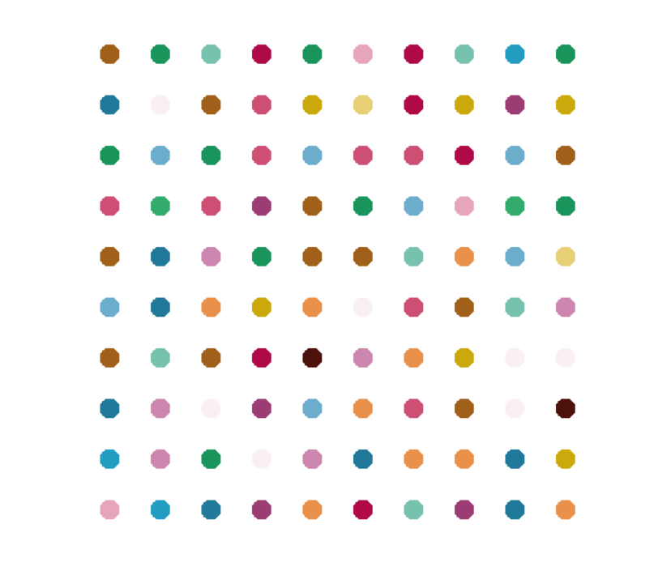

### Day 18 - Turtle and the Graphical User Interface (GUI)
- Day 18 Project: The Hirst Painting Project

### Day 18 Files:

- Drawing a square: turtle_1.py

- Drawing a dashed line: turtle_2.py

- Drawing different shapes: turtle_3.py

- Drawing a random walk: turtle_4.py

- Drawing a spirograph: turtle_5.py

- Day 18 Project - The Hirst Painting: main.py

### Day 18 Resources:

- [Turtle Graphics Documentation](https://docs.python.org/3/library/turtle.html)
- [Turtle Colors](https://cs111.wellesley.edu/reference/colors)
- [Trinket Turtle Colors](https://trinket.io/docs/colors)
- [What is a Random Walk?](https://en.wikipedia.org/wiki/Random_walk)
- [RGB Tool from W3Schools](https://www.w3schools.com/colors/colors_rgb.asp)
- [Colorgram Package](https://pypi.org/project/colorgram.py/)