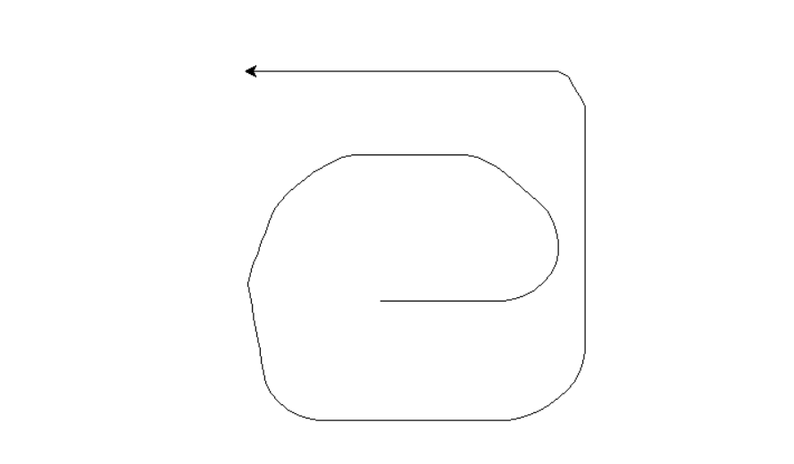
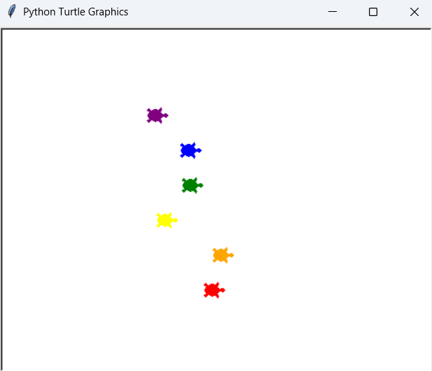

## Day 19 - Intermediate Instances, State and Higher Order Functions

### Etch-a-sketch App

Creating an etch-a-sketch app with the commands:
- Press "w" to move forwards.
- Press "s" to move backwards.
- Press "d" to turn right.
- Press "a" to turn left.
- Press "c" to clear the screen and move the cursor back to the center of the screen.

### Day 19 Project: Turtle Racing Game

### Day 19 Resources

- [Turtle Graphics Documentation](https://docs.python.org/3/library/turtle.html)