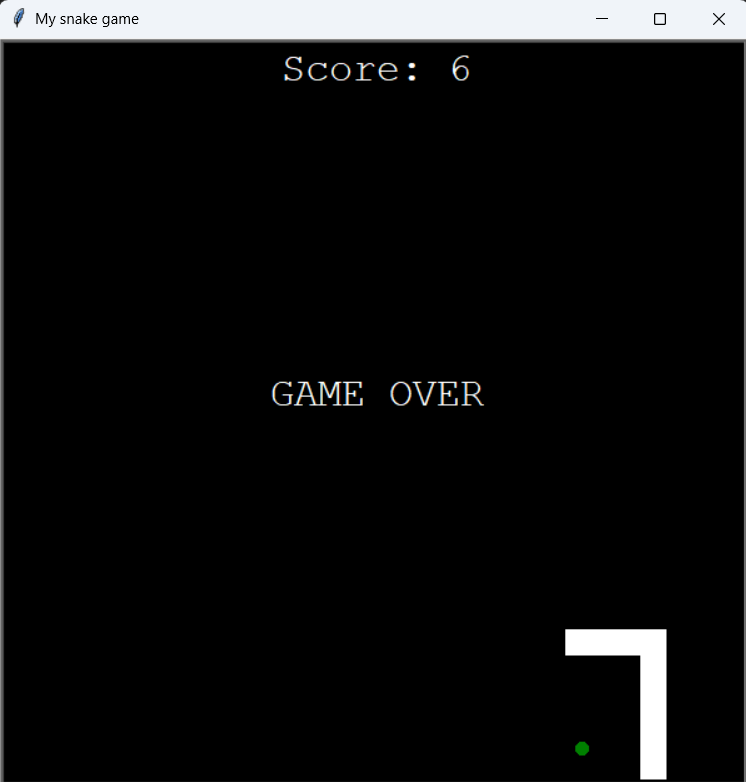

### Day 21 - Build the Snake Game Part 2: Inheritance and List Slicing
- Day 20 Project: The Snake Game - Part 2

For the second part of the Snake game project, we will:
- Detect colision with food.
- Create a scoreboard.
- Detect colision with wall.
- Detect colision with tail.



### Day 21 Resources

#### Class Inheritance
You can create a new class from an existing class, using it to inherit behavior (methods) and appearance (attributes). Instead of creating the class and its methods from scratch, you can use an existing class and just add a few new, relevant methods to this new class.
For example, a Pastry Chef class can be built from a Chef class, with skills such as baking, stirring and measuring. However, a Pastry Chef will have some specific skills such as kneading the dough and whisking.

In order to create a new class Fish (subclass) that inherits from an existing class Animal (superclass):

```
class Fish(Animal):
    def __init__(self):
        super().__init__()
```

For an example of how to inherit attributes and methods from a class (and modify them), check out the class_inheritance_example file.

#### How to Slice Lists and Tuples in Python

When we check for collision with the tail in the snake game, we use the following code to check for collision of the snake head with all its segments except for the head.

```
for segment in snake.segments:
    if segment == snake.head:
         pass
    elif snake.head.distance(segment) < 10:
        game_is_on = False
```

A simpler way to write this condition is using list slicing.

- list[2:5] selects items from the list with indexes between 2 (include) and 5 (exclusive). That is, the items between the 3rd (list[2]) and 5th (list[4]) elements. It does NOT include the item list[5].
- list[2:] selects elements starting from index 2 (list[2]) until the end of the list.
- list[:5] selects elements up to index 4 (list[4]).
- list[::2] selects every other element of the list.
- list[2:5:2] selects elements with indexes between 2 and 4, skipping every other (every second) element.
- list[::-1] returns a reversed list, with elements starting from the end all the way to the beginning.

So the code for detecting a snake collision with its tail could be simplified to:

```
for segment in snake.segments[1:]:
        if snake.head.distance(segment) < 10:
            game_is_on = False
```

