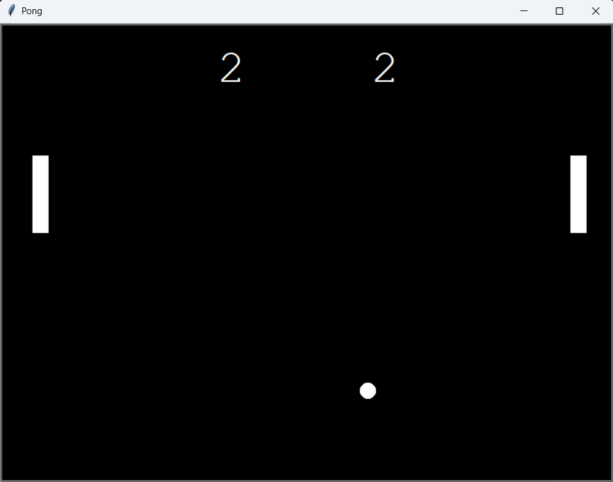

### Day 22 - Build Pong: The Famous Arcade Game
- Day 22 Project: Pong

\
How the game works:
- The two players move their paddles up and down with the keys W, S (left player) and up and down arrows (right player).
- The ball starts at the center of the screen.
- When one of the two players score, the ball reappears at the center of the screen and moves toward the player who scored.
- Whenever the paddle touches the ball, the speed of the ball increases.

\
We will create the Pong Arcade Game through these steps:
- Create the screen
- Create and move a paddle
- Create another paddle
- Create the ball and make it move
- Detect collision with wall and bounce
- Detect collision with paddle and bouce
- Detect when paddle misses
- Keep score

