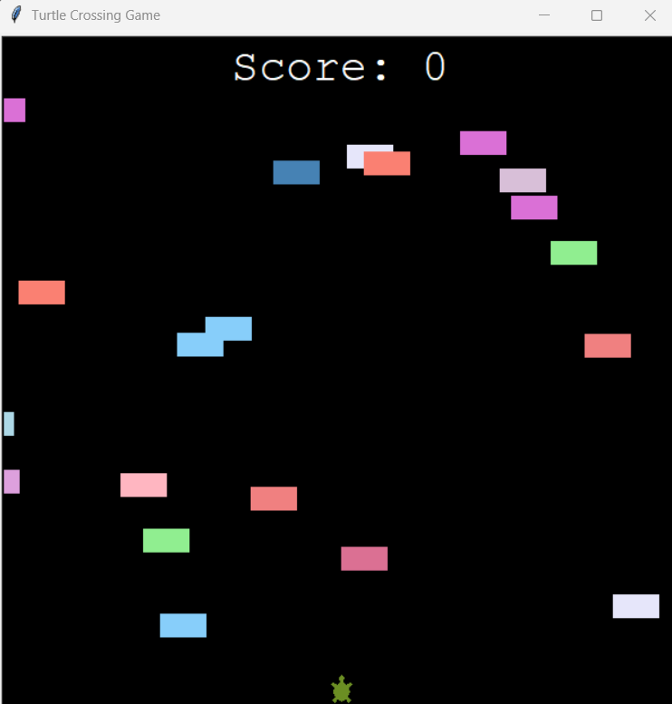
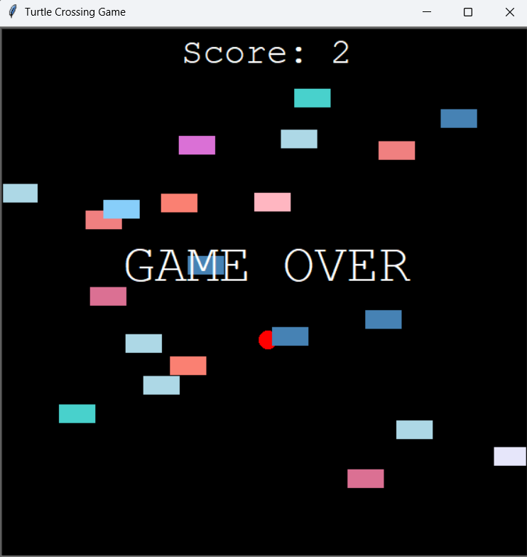

### Day 23 - The Turtle Crossing Capstone Project
- Day 23 Project - The Turtle Crossing Game

\
The Turtle Crossing Game Rules:

1. A turtle moves forwards when you press the "Up" key. It can only move forwards, not back, left or right.

2. Cars are randomly generated along the y-axis and will move from the right edge of the screen to the left edge.

3. When the turtle hits the top edge of the screen, it moves back to the original position and the player levels up. On the next level, the car speed increases.

4. When the turtle collides with a car, it is squished, it's game over and everything stops.

### Day 23 Resources
- [Turtle Graphics Documentation](https://docs.python.org/3/library/turtle.html)