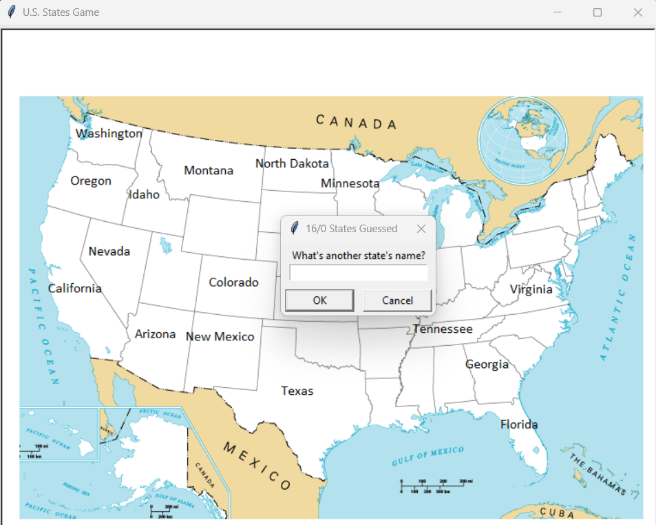

## Day 25 - Working with CSV Data and the Pandas Library
- Day 25 Project: The U.S. States Game

In this game, the user should attempt to guess the names of the 50 U.S. states.
- The user should type the name of one state at a time in the pop-up window.
- If the state name is correct, the written name will appear in the position corresponding to the state on the map.
- The current score is shown in the window title. The goal is to guess all 50 states. 
- When the game ends (the game window is closed), a CSV file "states_to_learn.csv" is saved containing the names of all the states that the user did not guess.

### Day 25 Resources

- [Pandas Documentation](https://pandas.pydata.org/docs/)
- [Pandas API Reference](https://pandas.pydata.org/docs/reference/index.html)
- [Sporcle US States Game](https://www.sporcle.com/games/g/states)