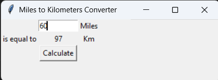

### Day 27 - Tkinter, *args, **kwargs and Creating GUI Programs
- Day 27 Project: Miles to Kilometers Converter



### Day 27 Resources
- [Python Docs: The Packer](https://docs.python.org/3/library/tkinter.html#the-packer)
- [TCL tk Docs: pack()](http://tcl.tk/man/tcl8.6/TkCmd/pack.htm)

#### Unlimited Positional Arguments
Python will create a tuple with all *args specified by the user.
```
def add(*args):
    sum = 0
    for n in args:
        sum += n
    return sum
```

#### Unlimited Keyword Arguments
This creates a dictionary pairing each argument (key) and values
```
def calculate(**kwargs):
    print(kwargs)
    for key, value in kwargs.items():
        print(key)
        print(value)

calculate(add=5, multiply=5)
```

We can also use the **kwargs to perform specific operations:
```
def calculate(n, **kwargs):
    n += kwargs["add"]
    n *= kwargs["multiply"]

calculate(2, add=5, multiply=5)
```

We can incorporate **kwargs when defining classes:
```
class Car:

    def __init__(self, **kw):
        self.make = kw["make"]
        self.model = kw["model"]

my_car = Car(make="Nissan", model="GT-R")
```

In this case, if we don't specify a make or a model for the car, Python will return an error.

If we want **kwargs to be optional, we can use the .get() method.

In this case, **kwargs not specified will be equal to None.
```
class Car:

    def __init__(self, **kw):
        self.make = kw.get("make")
        self.model = kw.get("model")
        self.color = kw.get("color")
        self.seats = kw.get("seats")

my_car = Car(make="Nissan")
```

How to update the properties of particular components we have created in tkinter:
```
my_label = tkinter.Label(text="I am a label", font=("Arial", 24, "bold"))

# Changing it as if it were a dictionary
my_label["text"] = "New Text"
# Using the config method
my_label.config(text="New Text")
```

#### How to position each of the widgets in your GUI program:
There are 3 layouts that you should know about:
- **Pack**: It packs each of the widgets next to each other in a vaguely logical format, from top to bottom (unless you specify another value for the "side" argument).
- **Place**: You can precisely place widgets by specifying x and y values.
- **Grid**: Divides your screen into columns and rows. This layout is always relative to other components, so if you have only one widget, it does not matter where you specify it, it will still show up in the same place. Note: You cannot mix up grid and pack in the same program.